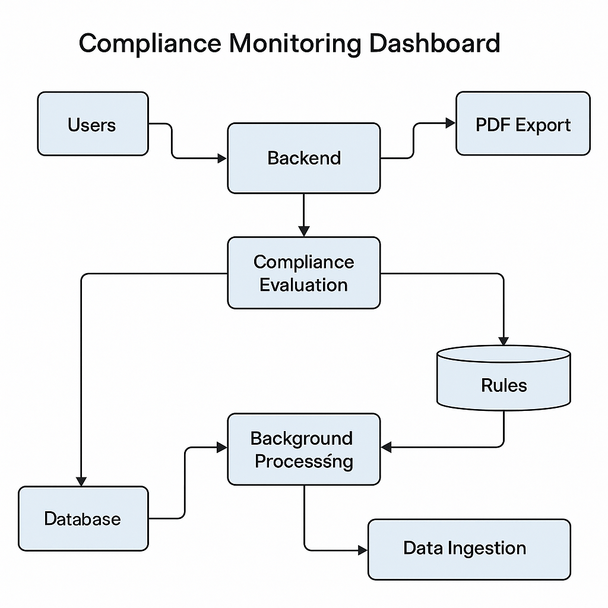

# Compliance Monitoring Dashboard

A full-stack application for real-time compliance tracking, rule-based evaluation, and reporting — built with .NET Core, React.js, RabbitMQ, and MongoDB.

---

## Features

- User Authentication (JWT)
- Rule Management (Create/Edit/Delete compliance rules)
- Real-time data ingestion and compliance checks
- Event-driven background processing with RabbitMQ
- Export compliance reports as PDF
- Responsive dashboard with charts and filters
- CI/CD with Azure DevOps
- Dockerized microservices with Nginx reverse proxy

---

## Tech Stack

| Layer       | Technology                         |
|-------------|-------------------------------------|
| Frontend    | React.js (with Axios, Chart.js)     |
| Backend     | .NET Core Web API + MediatR         |
| DB          | MongoDB                             |
| Messaging   | RabbitMQ                            |
| Worker      | .NET Hosted Service (Queue Consumer)|
| Auth        | JWT Bearer Authentication           |
| DevOps      | Azure DevOps + Docker + Nginx       |

---

## Architecture



---

## Setup Instructions

### 1. Clone the Repository

```bash
git clone https://github.com/yourusername/compliance-monitoring-dashboard.git
cd compliance-monitoring-dashboard
